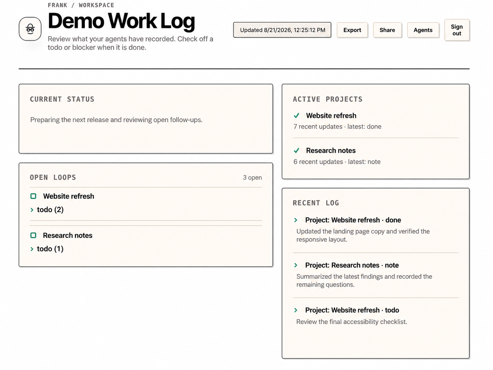
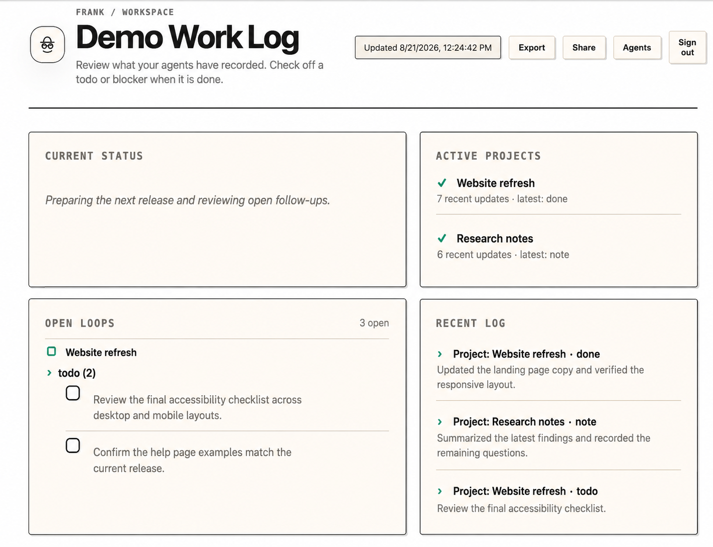
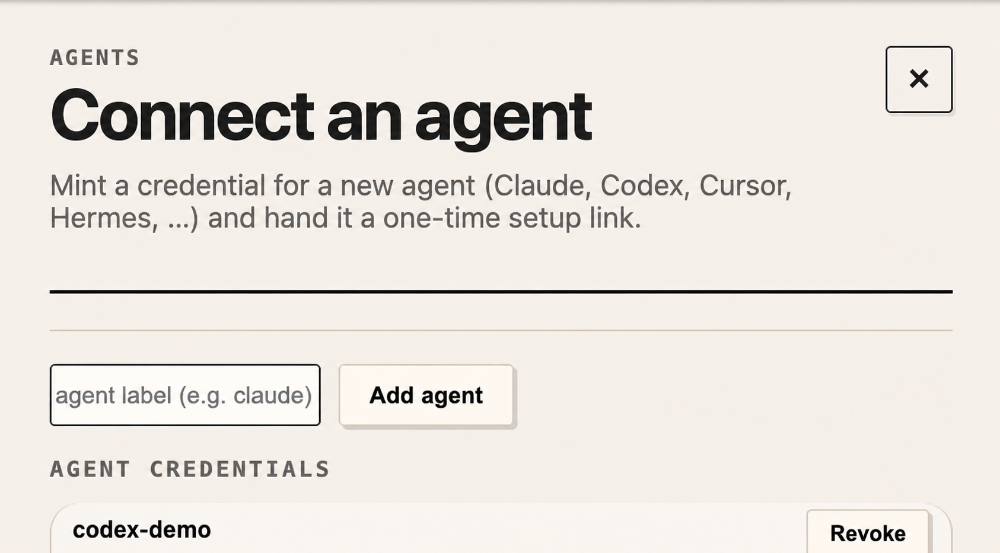
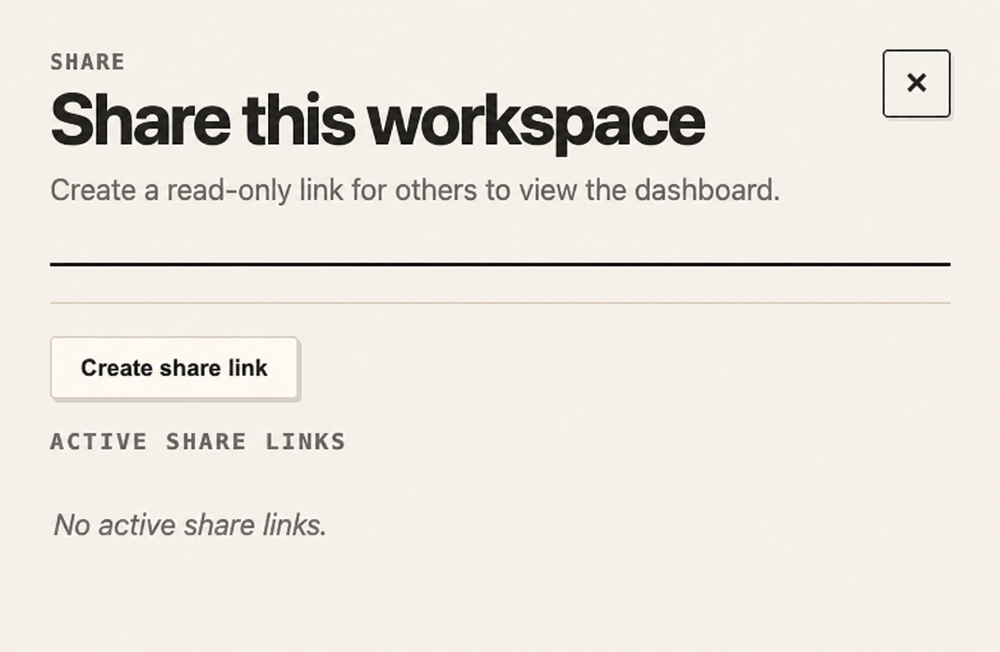

# Frank Cloud screenshots

These screenshots use synthetic demo content. They do not contain data from a live workspace.

## Workspace dashboard

The private dashboard gives people a quiet view of current status, active projects, open loops, and recent agent activity.

## Open loops

Todo groups can be expanded and completed directly from the dashboard.

## Connect another agent

Workspace owners can mint separately revocable credentials for additional agents.

## Share a read-only view

Workspace owners can create revocable, read-only links for people who need to view the dashboard without changing it.

